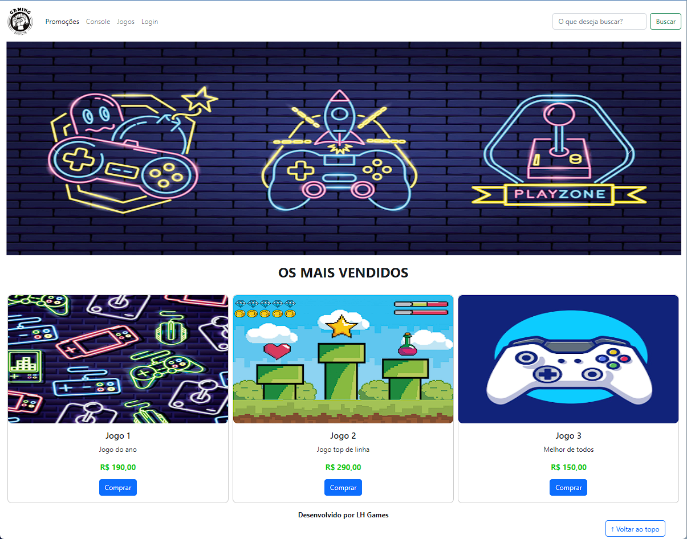
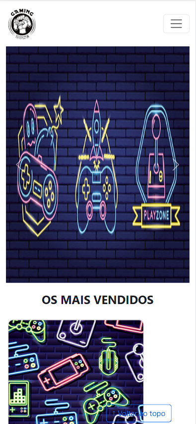
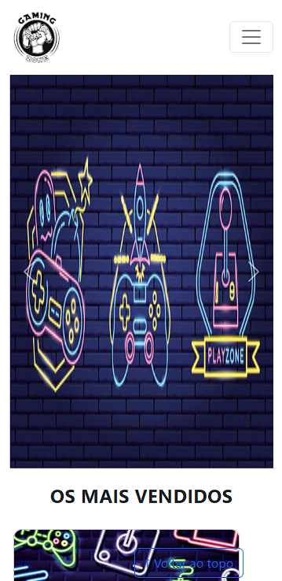

# lh-games
Landing Page de uma loja de tecnologia. Projeto desenvolvido para apresentar ao curso de FullStack oferecido pelo SENAI.

Imagens do projeto:
### Screenshot

### Links

- URL GitHub: [Link do repositorio](https://github.com/julioresende77/lh-games)
- URL Site: [link do site](https://julioresende77.github.io/lh-games/)

### Construído com

- Linguagem de marcação HTML5 semântica
- CSS propriedades personalizadas
- CSS Flex
- JavaScript

## Autor

- Linkedin - [Julio Resende](https://www.linkedin.com/in/resendedev/)
- Twitter - [@ResendeDev](https://www.twitter.com/ResendeDev)